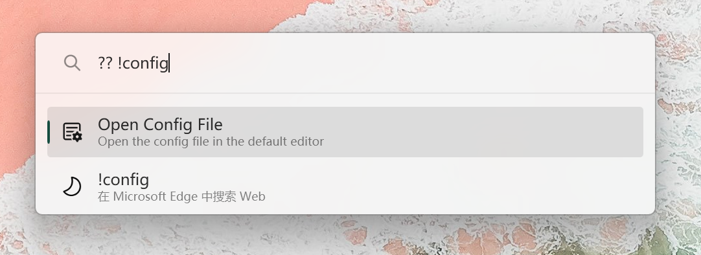

# PowerToys-Run-WebSearchShortcut

This is a simple [PowerToys Run](https://docs.microsoft.com/en-us/windows/powertoys/run) plugin for quickly select a specific search engine to perform searches.

## Preview


> If you have configured the 'Keyword' field, you can use the abbreviation keyword to specify the search engine.

## Requirements

- PowerToys minimum version 0.79.0

## Configuration field

### `Url`

The URL template for performing the search. Use `%s` as a placeholder for the search query. If the Url does not contain `%s`, the Url will be opened directly when you press enter.

### `Keyword`

Used to quickly select the target search engine.

### `SuggestionProvider`

Used to set the search suggestion.

**SuggestionProvider currently supported are:**

- `Google`
- `Bing`
- `Npm`
- `CanIUse`

PR welcome!

> You can also set a Provider to another search engine.
> eg:
>
> ```json
> {
>   "StackOverflow": {
>     "Url": "https://stackoverflow.com/search?q=%s",
>     "SuggestionProvider": "Google"
>   }
> }
> ```

### `IsDefault`

If this option is true, the corresponding search engine does not need to input the trigger word.

### `IconUrl`

You can customize the icon by setting this field. Under normal circumstances, you don't need to set this, as the plugin will automatically download the favicon of the website corresponding to the `Url` field. However, sometimes you might want to customize the icon, and this field comes in handy. **Note**: This field can only be set to a network URL and cannot be set to a local file.

### `ReplaceWhitespace`

You can specify which character(s) to replace a space with when performing a search.

For example, Wikipedia uses underscores (`_`), not plus signs (`+`) to separate words in the URL. "This is a test" → `https://en.wikipedia.org/wiki/This+is+a+test` (invalid ❌).

By setting `ReplaceWhitespace = "_"` for a search engine, the plugin will replace all spaces with underscores when performing the search. "This is a test" → `https://en.wikipedia.org/wiki/This_is_a_test` (valid ✅).

## Installation

- Download the [latest release](https://github.com/Daydreamer-riri/PowerToys-Run-WebSearchShortcut/releases/) by selecting the architecture that matches your machine: `x64` (more common) or `ARM64`
- Close PowerToys
- Extract the archive to `%LOCALAPPDATA%\Microsoft\PowerToys\PowerToys Run\Plugins`
- Open PowerToys

## Config

- Open config file:



- Inside the config file, you can add your desired search engines. The key is the display name of the search engine, and the `url` property is the URL template for performing the search.
eg:

```json
{
  "Google": {
    "Url": "https://www.google.com/search?q=%s",
    "SuggestionProvider": "Google"
  },
  "Bing": {
    "Url": "https://www.bing.com/search?q=%s",
    "SuggestionProvider": "Bing"
  },
  "GitHub": {
    "Url": "https://www.github.com/search?q=%s"
  },
  "GitHubStars": {
    "Url": "https://github.com/stars?q=%s",
    "Keyword": "gs"
  },
  "StackOverflow": {
    "Url": "https://stackoverflow.com/search?q=%s",
    "Keyword": "st"
  },
  "npm": {
    "Url": "https://www.npmjs.com/search?q=%s"
  }
}
```

- Run `reload`:


## Roadmap

- [x] Keyword field
- [x] Search suggestions

## Credits

- This project can only be completed under the guidance of [this article](https://conductofcode.io/post/creating-custom-powertoys-run-plugins/). Thanks to @hlaueriksson for his great work.

- The search suggestion feature of this project is based on the relevant implementation of [FlowLauncher](https://github.com/Flow-Launcher/Flow.Launcher?tab=readme-ov-file#web-searches--urls), thanks @Flow-Launcher!

## License

[MIT](./LICENSE) License © 2023 [Riri](https://github.com/Daydreamer-riri)
